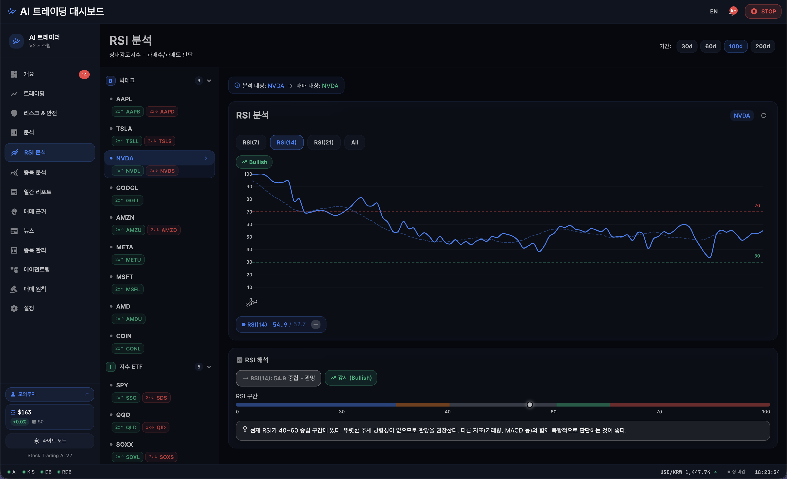
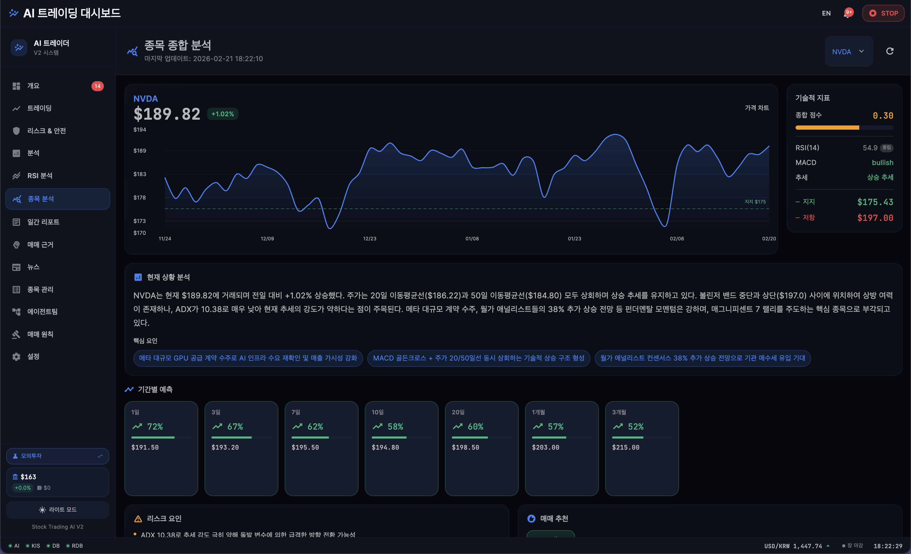
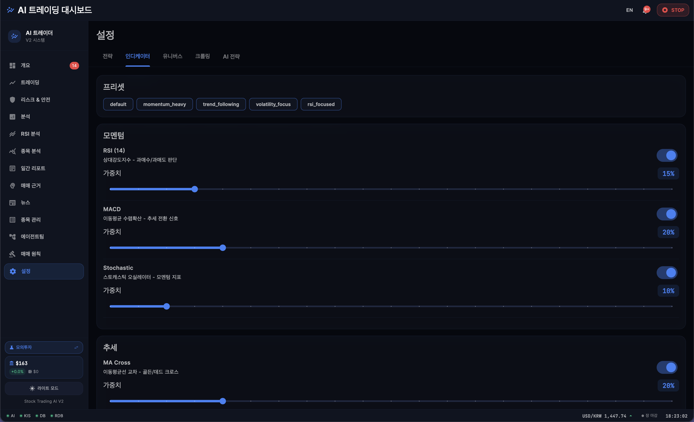
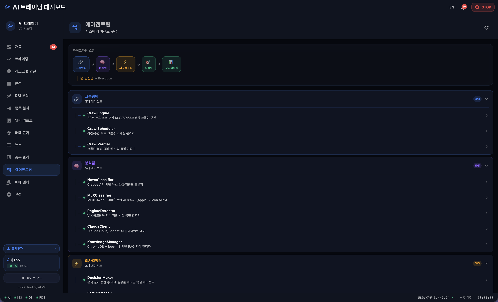
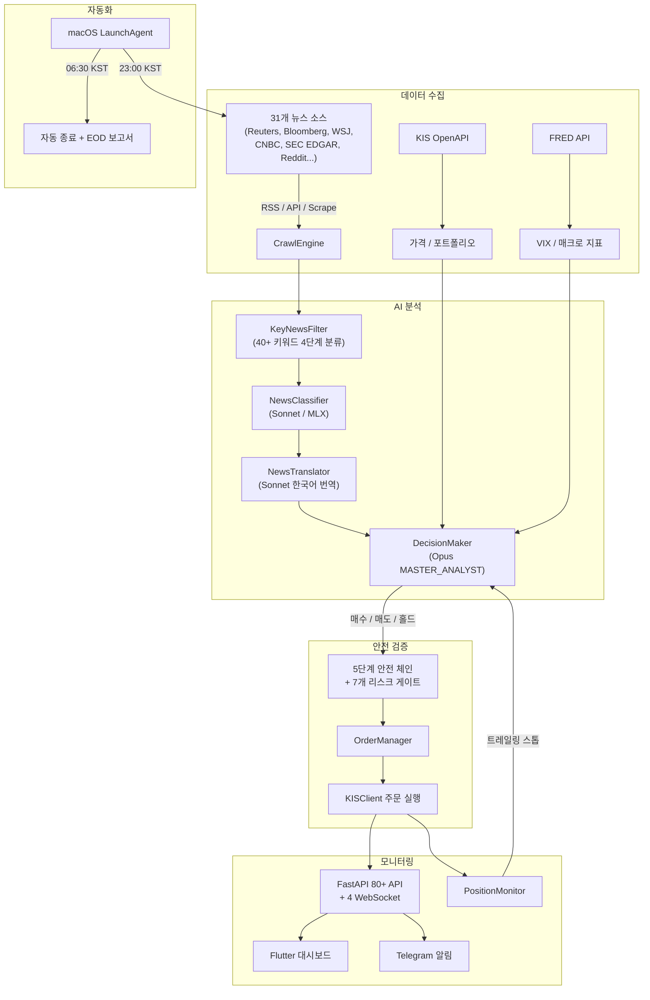

# Auto Trade v2 — AI 기반 미국 레버리지 ETF 자동매매 시스템

> Claude Opus/Sonnet + 로컬 MLX AI가 31개 뉴스 소스를 실시간 분석하고, 5단계 안전 체인과 7개 리스크 게이트를 거쳐 미국 2X 레버리지 ETF를 자동매매하는 시스템이다.

---

## 대시보드

<table>
  <tr>
    <td></td>
    <td></td>
  </tr>
  <tr>
    <td></td>
    <td></td>
  </tr>
</table>

---

## 시스템 개요

| 항목 | 수치 |
|------|------|
| 총 코드 규모 | **114,445줄** (Python 53,107 + Dart 42,317 + 테스트 19,021) |
| Python 소스 | 145개 파일 |
| Dart 소스 | 112개 파일 |
| REST API | 15개 라우터, **80+ 엔드포인트** |
| WebSocket | 4개 (포지션, 매매, 크롤링, 알림) |
| 뉴스 크롤러 | **31개 소스** (RSS/API/Scraping) |
| DB 모델 | 25개 테이블 (PostgreSQL + pgvector) |
| 대시보드 | 26+ 화면, 27 위젯, 24 Provider |
| ETF 매핑 | **18쌍** (본주 → 레버리지) |
| 테스트 | 753개 통과, Grade S (98/100) |
| AI 태스크 | Opus 13 + Sonnet 10 + MLX 로컬 |

---

## 파이프라인



---

## AI 모델 아키텍처

3종 AI 모델 체제로 비용 효율성과 판단 정확도를 동시에 확보한다.

### Claude Opus 4.6 — 고위험 판단 (13 태스크)

매매 의사결정, 시장 레짐 감지, 종합분석 등 정확도가 최우선인 태스크에 사용한다.

| 태스크 | 설명 |
|--------|------|
| `trading_decision` | 최종 매매 의사결정 |
| `overnight_judgment` | 오버나잇 포지션 보유/청산 판단 |
| `regime_detection` | 시장 레짐 감지 (bull/bear/sideways/crash) |
| `continuous_analysis` | 30분 단위 연속 시장 분석 |
| `comprehensive_*` (5) | 종합분석팀 — 매크로/기술/센티먼트/리더/EOD |
| `daily/weekly/monthly` | 일간/주간/월간 피드백 |
| `realtime_stock_analysis` | 실시간 종목 분석 |

### Claude Sonnet 4.5 — 경량 분석 (10 태스크)

뉴스 분류, 번역, 텔레그램 응답 등 빠른 처리가 필요한 태스크에 사용한다.

| 태스크 | 설명 |
|--------|------|
| `news_classification` | 뉴스 영향도 분류 |
| `news_translation` | 뉴스 한국어 번역 (배치 10건) |
| `crawl_verification` | 크롤링 데이터 검증 |
| `telegram_intent/chat` | 텔레그램 의도 분석 + 대화 |
| `historical_*` (4) | 과거 데이터 분석 (시장/기업/섹터/타임라인) |
| `delta_analysis` | 변동 분석 |

### Qwen3-30B-A3B — 로컬 뉴스 분류 (MLX)

Apple Silicon MPS에서 MLX로 로컬 실행한다. API 비용 없이 뉴스를 1차 분류한다.

- 30B 파라미터 중 3B 활성화 (MoE), 4bit 양자화
- 키워드 기반 빠른 필터링 → AI 의미 분석 2단계 처리

### 모델 라우팅

```
Opus  ← 매매 판단, 레짐 감지, 종합분석 (정확도 최우선)
Sonnet ← 뉴스 분류, 번역, 텔레그램, 과거 분석 (속도 + 비용 효율)
MLX   ← 뉴스 1차 분류 (API 비용 제로)
```

---

## 핵심 기능

### 뉴스 수집 & AI 분석

- **31개 소스 크롤링** — Reuters, Bloomberg, WSJ, CNBC, SEC EDGAR, Reddit, Finnhub 등 RSS/API/Scraping으로 실시간 수집한다
- **4단계 중요도 분류** — KeyNewsFilter가 40+ 키워드로 critical/high/medium/low를 판정한다
- **한국어 번역** — 핵심뉴스(critical~medium)만 Sonnet으로 배치 번역하여 API 비용을 절감한다
- **연속 분석** — 23:00~06:30 KST 동안 30분 주기로 Opus가 시장 이슈를 분석한다

### 자동매매 실행

- **MASTER_ANALYST 페르소나** — 5대 투자대가(Dalio, Soros, Druckenmiller, Simons, Jones) 기반 AI 매매 판단
- **18쌍 ETF 매핑** — 본주(SPY, QQQ, NVDA 등) 분석 후 레버리지 ETF(SSO, QLD, NVDL 등)로 주문한다
- **Triple RSI 전략** — RSI(7/14/21) + Signal(9) 기반 진입/청산 타이밍을 포착한다
- **생존 매매 모드** — 월 $300 운영비를 수익으로 반드시 충당하는 원칙을 적용한다
- **KIS 듀얼 인증** — 모의/실전 듀얼 모드로 안전하게 전환한다

### 5단계 안전 체인 + 7개 리스크 게이트

**안전 체인** (순차 검증):

```
HardSafety (절대 불가침)
  → SafetyChecker (QuotaGuard + HardSafety 통합)
    → EmergencyProtocol (긴급 프로토콜 + Circuit Breaker)
      → CapitalGuard (자본금 보호 - 3중 잔고 검증)
        → AccountSafetyChecker (계좌 안전 검증)
```

| 규칙 | 값 | 동작 |
|------|-----|------|
| 종목당 최대 포지션 | 15% | 초과 시 주문 거부 |
| 전체 포지션 합계 | 80% | 초과 시 주문 거부 |
| 일일 손실 한도 | -5% | 도달 시 전면 매매 중단 |
| 단일 종목 손절 | -2% | 즉시 전량 매도 |
| VIX 매매 중단 | 35 이상 | 신규 매수 전면 중단 |

**리스크 게이트** (병렬 점검):

| 게이트 | 기능 |
|--------|------|
| DailyLossLimiter | 일일 손실 한도 관리 |
| ConcentrationLimiter | 종목 집중도 제한 |
| LosingStreakDetector | 연속 손실 감지 |
| SimpleVaR | Value at Risk 계산 |
| RiskBudget | 리스크 예산 배분 |
| TrailingStopLoss | 트레일링 스톱로스 |
| RiskBacktester | 리스크 백테스트 |

### 실시간 모니터링

- **Flutter Desktop 대시보드** — 26+ 화면으로 포지션, 차트, 뉴스, 매매 근거, 리스크를 모니터링한다
- **80+ REST API** — 15개 라우터로 시스템 전체 상태를 조회/제어한다
- **4 WebSocket** — 포지션(2초), 매매 체결, 크롤링 진행, 알림을 실시간 스트리밍한다
- **AI 에이전트 팀** — 5개 팀(크롤링/분석/의사결정/실행/모니터링)의 상태를 실시간 추적한다

### Telegram 알림

- **핵심뉴스 알림** — critical/high/medium 뉴스를 한국어로 번역하여 즉시 발송한다
- **매매 체결 알림** — 주문 체결, 손절, 긴급 이벤트를 실시간 알린다
- **양방향 봇** — 자연어 명령으로 포지션 조회, 매매 실행, 시스템 제어가 가능하다
- **일일 보고서** — 장 마감 후 성과 요약, 벤치마크 비교를 자동 발송한다

---

## 기술 스택

| 영역 | 기술 |
|------|------|
| AI 분석 | Claude Opus 4.6 / Sonnet 4.5 (Anthropic API / Claude Code MAX) |
| 로컬 AI | MLX + Qwen3-30B-A3B (Apple Silicon MPS, 4bit 양자화) |
| RAG | ChromaDB + BGE-M3 임베딩 (1024차원 벡터) |
| 백엔드 | Python 3.11+, FastAPI, SQLAlchemy 2.0 (async) |
| 데이터베이스 | PostgreSQL 17 + pgvector, Redis 7 |
| 대시보드 | Flutter Desktop (macOS), Provider 패턴 |
| 브로커 API | KIS OpenAPI (한국투자증권, 모의/실전 듀얼 모드) |
| 인프라 | Docker Compose (PostgreSQL + Redis), macOS LaunchAgent |
| 알림 | Telegram Bot API (양방향, 2채널 지원) |

---

## 실행 방법

```bash
# 1. 환경변수 설정
cp .env.example .env
# .env 파일 편집 — 각 항목 설명은 .env.example 참조

# 2. Docker 서비스 시작 (PostgreSQL + Redis)
docker compose up -d

# 3. Python 환경 설정
python3 -m venv .venv
source .venv/bin/activate
pip install -r requirements.txt

# 4. 시스템 실행
python3 -m src.main

# 5. 대시보드 실행 (별도 터미널)
cd dashboard && flutter run -d macos
```

---

## 프로젝트 구조

```
Stock_Trading/
├── src/                          # Python 백엔드 (145파일, 53,107줄)
│   ├── main.py                   # TradingSystem 오케스트레이터 (2,438줄)
│   ├── analysis/                 # AI 분석 (Claude Client, 분류, 번역, 의사결정)
│   ├── orchestration/            # 준비/매매/연속분석/뉴스 파이프라인
│   ├── crawler/                  # 31개 소스 크롤링 엔진
│   ├── executor/                 # KIS API 브로커 (주문, 포지션, 청산)
│   ├── safety/                   # 5단계 안전 체인
│   ├── risk/                     # 7개 리스크 게이트
│   ├── strategy/                 # 전략 파라미터, 진입/청산, 수익 목표
│   ├── indicators/               # 기술적 지표 (RSI, MACD, 볼린저)
│   ├── monitoring/               # FastAPI 서버 (80+ API, 4 WebSocket)
│   ├── telegram/                 # 양방향 Telegram 봇
│   ├── feedback/                 # 일간/주간 피드백 루프
│   ├── ai/                       # MLX 로컬 AI + RAG 지식 관리
│   ├── db/                       # 25개 ORM 모델
│   └── utils/                    # 설정, 로거, 시장 시간, 티커 매핑
├── dashboard/                    # Flutter macOS Desktop (112파일, 42,317줄)
│   └── lib/
│       ├── screens/              # 26+ 화면
│       ├── providers/            # 24 Provider
│       ├── widgets/              # 27 위젯
│       └── services/             # API 서비스
├── docker-compose.yml            # PostgreSQL 17 + Redis 7
├── strategy_params.json          # 전략 파라미터 + 생존 매매 설정
└── requirements.txt              # Python 의존성
```
