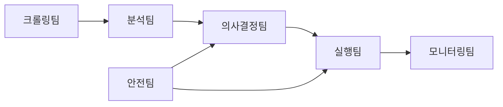

# AI 트레이딩 에이전트팀 구성도 (V2)

## 파이프라인 흐름

## AI 모델 사용 현황

| 모델 | 용도 | 호출 위치 |
|---|---|---|
| Claude Sonnet | ComprehensiveTeam 5개 에이전트 순차 실행 | comprehensive_team.py |
| Claude Sonnet | 상황 감지/평가 | situation_tracker.py |
| Claude Sonnet | EOD 피드백 보고서 | eod_feedback_report.py |
| Claude Haiku | 뉴스 분류 정밀화 (impact ≥ 0.5) | news_classifier.py |
| Claude Haiku | 텔레그램 뉴스 포맷팅 | telegram_formatter.py |
| MLX (Qwen3-30B-A3B) | 뉴스 1차 분류 (3중 앙상블) | local_llm.py |
| MLX (Bllossom-8B) | 뉴스 제목 번역 | news_translator.py |

## 팀별 에이전트 목록

### 1. 크롤링팀 (Crawling Team)

| 에이전트 ID | 이름 | 역할 요약 |
|---|---|---|
| crawl_engine | CrawlEngine | 30개 뉴스 소스 병렬 크롤링 (RSS/API/스크래핑) |
| crawl_scheduler | CrawlScheduler | 야간/주간 모드 스케줄링 |
| crawl_verifier | CrawlVerifier | 크롤링 품질 검증 |

### 2. 분석팀 (Analysis Team)

| 에이전트 ID | 이름 | 역할 요약 |
|---|---|---|
| news_analyst | News Analyst | 뉴스 영향도 평가/방향성 판단 (AI 페르소나, Sonnet) |
| news_classifier | NewsClassifier | MLX 1차 분류 + Haiku 정밀화 |
| mlx_classifier | MLXClassifier | Qwen3-30B-A3B 로컬 3중 앙상블 분류 |
| regime_detector | RegimeDetector | VIX 기반 5단계 시장 레짐 감지 |
| claude_client | ClaudeClient | Claude Sonnet/Haiku API 클라이언트 |
| knowledge_manager | KnowledgeManager | ChromaDB + bge-m3 RAG 지식베이스 |

### 3. 의사결정팀 (Decision Team)

| 에이전트 ID | 이름 | 역할 요약 |
|---|---|---|
| master_analyst | Master Analyst | 5개 에이전트 종합 분석 최종 판단 (AI 페르소나, Sonnet) |
| decision_maker | DecisionMaker | ComprehensiveReport 기반 로컬 매매 판단 |
| entry_strategy | EntryStrategy | 진입 전략 (손익비 계산, 신뢰도 검증) |
| exit_strategy | ExitStrategy | 청산 전략 (익절/손절/트레일링 스탑) |
| macro_strategist | Macro Strategist | 거시 경제 분석 (AI 페르소나, Sonnet) |
| short_term_trader | Short Term Trader | 단기 매매 전략 (AI 페르소나, Sonnet) |
| risk_manager | Risk Manager | 리스크 관리/안전장치 (AI 페르소나, Sonnet) |

### 4. 실행팀 (Execution Team)

| 에이전트 ID | 이름 | 역할 요약 |
|---|---|---|
| order_manager | OrderManager | 주문 실행/관리 (스나이퍼 엑스큐션) |
| kis_client | KISClient | 한국투자증권 OpenAPI 연동 (실전/모의) |
| position_monitor | PositionMonitor | 포지션 실시간 모니터링 |

### 5. 안전팀 (Safety Team)

| 에이전트 ID | 이름 | 역할 요약 |
|---|---|---|
| hard_safety | HardSafety | 하드 리밋 (일일 손실 -5%, VIX 40 초과) |
| safety_checker | SafetyChecker | 통합 안전 검증 체인 |
| emergency_protocol | EmergencyProtocol | 5가지 비상 시나리오 대응 |
| capital_guard | CapitalGuard | 현물만 매수, 잔액 초과 차단 |

### 6. 모니터링팀 (Monitoring Team)

| 에이전트 ID | 이름 | 역할 요약 |
|---|---|---|
| alert_manager | AlertManager | 알림 관리 (Redis + Telegram) |
| telegram_notifier | TelegramNotifier | 2계정 동시 알림 발송 |
| benchmark | BenchmarkComparison | SPY/SSO 벤치마크 비교 |
| daily_feedback | DailyFeedback | Claude Sonnet EOD 성과 분석 |
| weekly_analysis | WeeklyAnalysis | 주간 성과 심층 분석 (로컬 ML) |
